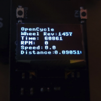
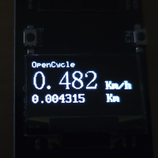
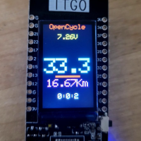
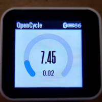

# What is this?
This project is to create a fully open sourced cycling computer based on micro-controller hardwares such as ESP32 and Pi Pico. \
This project is still a working progress and are at a very early stage so please forgive me for the current state.
|        Oled debug       |        Oled Normal      |        T-Display        |         T-Watch         |
|:-----------------------:|:-----------------------:|:-----------------------:|:-----------------------:|
|||||
# Why Open Cycle?
Similar project exist on ARM-Linux platforms but I want something that can be run on very miniature hardware while still maintain good battery life. \
One of the goal for this project is to create a software platform to make it easier to make your own cycling computer with your choices of hardware and interface.\
If you have a project with specific hardware and sensor in mind, feel free to try this out or open an issue so I can help as well. 
# Hardware compatibility
You will need an Arduino or MicroPython compatible micro-controller such as one based on the ESP-32 module or the Pi-Pico module, with one of the following display module:\
- SSD1306
- ST7789

Currently, the following hardware are tested with MicroPython :
- ESP32 with SSD1306 OLED display on I2C.
- TTGO T-Display (ESP32 with ST7789 LCD).

And the following are being tested with Arduino/C++ :
- TTGO T-Watch 2019 with touch (and GPS module)
- TTGO T-Watch 2020 v2
- Theoretically, all other T-Watch models should be at lease partially supported.

You will also need a speed/Cadence sensor for your bike. This can be home made or off-the-shelf as long as it follows the Bluetooth SIG's [*Cycling Speed and Cadence GATT profile*](https://www.bluetooth.com/wp-content/uploads/Sitecore-Media-Library/Gatt/Xml/Services/org.bluetooth.service.cycling_speed_and_cadence.xml).\
I uses a [XOSS speed/Cadence sensor](https://shop.xoss.co/collections/xoss-cadence-speed-sensor/products/xoss-cadence-speed-sensor) just because its the cheapest I can find.

If you want make OpenCycle to support new hardwares, feel free to contribute :) \
Or you can open an issue with the ```new hardware``` label.
# What is working right now?
- BLE communication with the speed/cadence sensor
- Displaying basic information (Speed, distance, etc.) for:
  - SSD1306
  - ST7789
- Modular setup for custom screen
# How to run (MicroPython)
Using your preferred method copy all *.py* file, the *oled_font* folder and *font5x8.bin* to your micro-controller.\
Make sure your speed/Cadence sensor is awake and has a service UUID 0x1816 (This should be the case for most sensor) \
In *open_cycle.py* uncomment the screen you would like to use:
```Python
# Choose your display here =====================
# oled_diplay = DebugOled(5, 4)
# oled_diplay = OCOled(5, 4)
# oled_diplay = DebugTdisp()
# oled_diplay = ColorTdisp()
# ==============================================
```
`DebugOled` and `OCOled` works with thE SSD1306 display, `DebugTdisp` and `ColorTdisp` works with the T-Display (ST7789) \
Run `open_cycle.run_openCycle()`
# How to make you own screen interface? (MicroPython)
Make a sub-class of either `OledDisplay` or `TDisplay` and implement the following method:
```python
show_msg(self, title, msg0="", msg1="", msg2="")

show_csc(self, speed, distance, rpm, raw)
```
# Work with T-Watch
My current focus is on exploring the capability of the TTGO T-Watches. Due to the manufacture library support, I am redoing everything in Arduino/C++.\
If you are interested, give it a try (look under *cpp/test*). Make sure you have ESP32 arduino core 1.0.6 and  *TTGO TWatch Library* installed.
# Change log:
### 2021-12-27:
Finishing the first working version of display for T-Watch. Checkout under */cpp*
### 2021-11-13:
Adding support for the TTGO T-Display as its a very nice piece of hardware.
- Modifying the [st7789my](https://gitlab.com/pascalokm/t-watch2020-esp32-with-micropython/-/blob/master/st7789my.py) to enable text scaling and draw circle
- Enable asynchronous display update. Due to the slow nature of ST7789, i change the display to no longer in sync with the bluetooth call back. This allows many nice thing like update speed more often than others and much faster connections speed
- Adding new colour screen with run time and battery voltage 
### 2021-11-06:
Modularize display implementation. Also added new nicer screen with larger speed font.\
Thanks for the nicer [OLED font library](https://github.com/micropython-Chinese-Community/mpy-lib/tree/master/LED/OLED_I2C_ASC) from MicroPython Chinese community
### 2021-10-30:
Add speed and distance calculation
### 2021-10-24:
Finally getting data from the speed/Cadence sensor